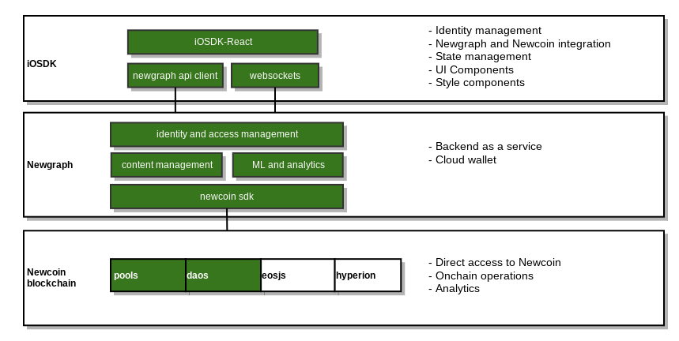

# iOSDK by the Newcoin Foundation

iOSDK is enabling developers to buidl amazing applications on top of Newcoin in record time.

## Overview

Blockchain development is hard. Managing authorization, users, content and relationships is hard. Building backends and UIs is hard. iOSDK and the Newgraph API are set to help teams reach business logic implementation sooner.

## Environment Overview



## Installation
### Project starter

Use this if starting a project from scratch. This stage involves 

```
    curl https://raw.githubusercontent.com/Newcoin-Foundation/iosdk/main/scripts/create.sh | bash -s <project-name>
```

This will generate a demo [craco](https://github.com/gsoft-inc/craco)-based project. (craco is a layer on top of create-react-app that allows easier customization of webpack, among other things overriding lesscss variables used by ant-design styles).

Run ``` craco start ``` to start the demo app.

### Add to an existing project

```
npm i @newcoin-foundation/iosdk --save
```

You will likely want to use parts of the SDK in such scenario, see Usage below.

### API Clients only
For existing condebases you might be interested in lower-level components only. This involves lower level work and  Consider `@newcoin-foundation/newcoin-sdk` and/or `@newcoin-foundation/newgraph-api-client` depending on your implementation plan.

### Other languages/technologies
Newgraph API (see below) is described as a Swagger and can be used to generate a client in any language. We welcome contributions in this space.

## Usage
### Full SDK
Following the Project Starter section under Installation above, you should by now have an installed project that shows a default landing page for the user.

#### Application
Check `src/index.tsx` for the basic setup.
Note the single <App /> component representing a full application which you will extend as described in the following sections.

#### Adding routes
Some routes and pages are provided as part of the SDK. Add more routes and pages using the built in `react-router` as shown in `src/index.tsx`:
```
    <App config={config}>
      <Route key="hello" exact path="/hello" component={HelloIO} />
      <Route key="goodbye" exact path="/goodbye" component={GoodbyeIO} />
    </App>
```

#### Extending state management
iOSDK manages state and provides actions to interact with it and the underlying API libraries. However your use case is unique, and you will likely need to add more state, actions and effects.
Note `src/overmind/app.ts`. It provides an example for setting up a simple counter state. This state is included in the larger state provided by the SDK so you can add your logic on top of what's already provided:

```
import { Action } from "@newcoin-foundation/iosdk/src/types";

const test : Action = (({ state, actions }) => {
    // actions.custom.info();
    state.app.counter++;
});


export const app = {
    app: {
        actions: {
            test
        },
        state: {
            counter: 0
        },
        effects: {}
    }
};

export default app;
```

Check the overmind docs for [namespaced](https://overmindjs.org/api-1/namespaced) to see how you can nest state and actions to implement complex use cases.

### Creating pages

Pages are normal react components, however note that by importing:

`import { useActions, useAppState } from '@newcoin-foundation/iosdk/src/overmind';`

you are getting the state with your custom actions defined in the previous section injected right into `actions` and `state`. This means no extra work needs to be done to use them immediately as in the usage of `state.app.test()` and `state.app.counter` below:  

```
const HelloIO: NLView = () => {
  const actions = useActions();
  const state = useAppState();

  return <>
    Hello {state.api.auth.user?.username}!
    <div>
      <Button onClick={ () => {
        actions.app.test()
      }}>Count: {state.app.counter}</Button>
      <Button
        onClick={() => actions.routing.historyPush({ location: "/goodbye" })}>Goodbye button</Button>
    </div>
  </>
}

const GoodbyeIO: NLView = () => <>
  Goodbye IO!
  <div>
    <Link to="/hello">Hello</Link>
  </div>
</>
```

### With partial sdk
The state management part of the SDK is currently the best source of examples for using the Newgraph and Newcoin apis. We are also working on more materials to cover this space. 

## Newgraph 
Newgraph is a fully serverless managed API service providing a generic backend for creative economy applications built to interact with Newcoin.
By large, newgraph features:
* a REST api
* a websockets server
* firebase authentication
* an advanced filesystem-like content management system with media processing capability
* Newcoin cloud wallet (testnet phase)
* analytics and search 
* data sharing and security features


## Stack

These awesome underlying technologies and their dependencies are used to make the imlementation possible with reasonable effort:

|  | Technology | Notes |  |
|---|---|---|---|
| Language | Typescript | A Bhai-lang implementation is considered |  |
| Authorization | Firebase | More is underway |  |
| Component framework | React | Implementations for vue, angular, svetle and others are under consideration |  |
| State management | Overmindjs | See [overmindjs](https://overmindjs.org/). |  |
| Component library | Ant design | See [https://ant.design/](antd) |  |


There are more opensource technologies we all know and love than we can enumerate here, see package.json for an overview or follow along with the docs.

## Status
This is a very early release and should not be considered stable. We are working hard to improve this, but you've been warned.

## Change history
### v0.5
* Early public release
* Good vibes

## Contributions
This project is under very active development. Submit a pull request or an issue to make it better. 

## See also
* [Newcoin Foundation](https://newcoin.org)
* [Newcoin Economy](https://docs.newcoin.org/)

## License
MIT

